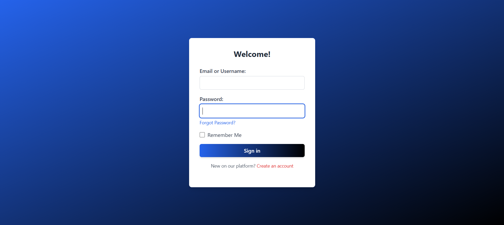
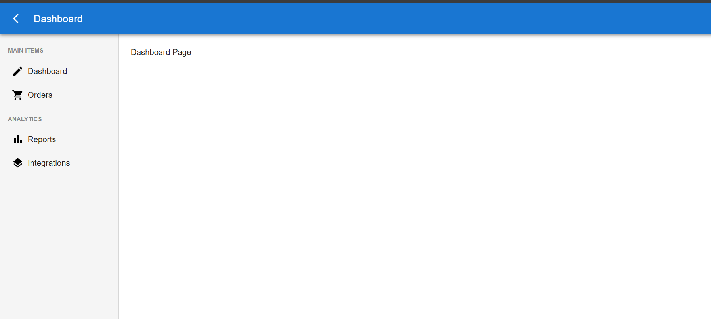
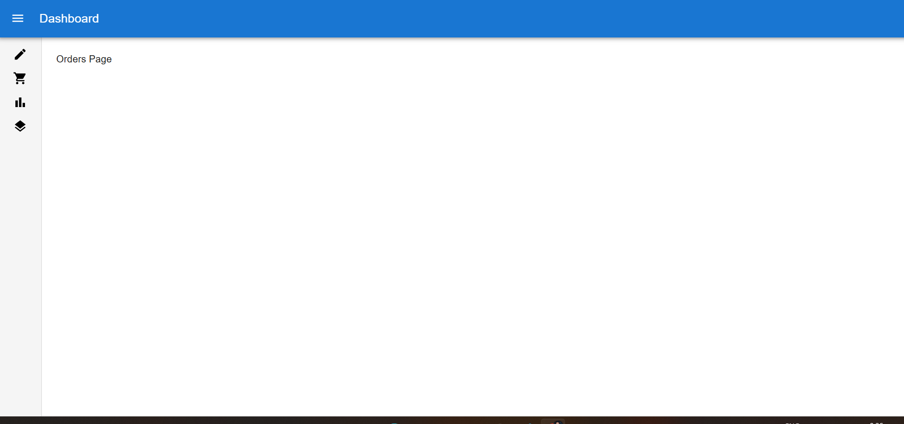

# 🚀 Dashboard Template with MUI and Vite + React.js

## 👋 Welcome!

This is a **simple template** to help developers quickly start building **React.js** applications with **Material-UI (MUI)** and **Tailwind CSS**. It's designed to provide a clean and responsive dashboard layout to kick off your project development!

---

## ✨ Features

- **📐 Responsive Sidebar** powered by Material-UI
- **🔐 Login Form** with email/password authentication
- **📊 Dashboard Pages** (Dashboard, Orders, Reports, Integrations)
- **⚡️ Fast Styling** with Tailwind CSS
- **🎨 Theming** using Material-UI
- **🔄 Page Routing** with React Router
- **🖼️ Material UI Icons** integrated in navigation

## 💻 Installation

### 1. Clone the Repository

To get started, clone this repository to your local machine:

```bash
git clone https://github.com/Leonardburgos/leonardburgos-dashboardMUI-react.git
```

### 2. Install Dependencies

Navigate to the project directory and install the required packages. You can use either `npm i` or `npm install`:

```bash
cd leonardburgos-dashboardMUI-react
npm install
```

### 3. Run the Project

Start the development server by running the following command:

```bash
npm run dev
```

---

## 🚀 How to Run

1. **Install Dependencies**  
   First, navigate to your project folder and install the required packages. You can use either of the following commands:

   ```bash
   npm install
   ```

   or

   ```bash
   npm i
   ```

2. **Start the Development Server**  
   Once the dependencies are installed, run the following command to start the development server:

   ```bash
   npm run dev
   ```

---

## 🏃‍♂️ Access the Dashboard

Once the app is running, simply navigate to `#/dashboard` in your browser's URL bar to go to the **Dashboard** page.

---

## 📸 Screenshots

### Login Page


### Dashboard


